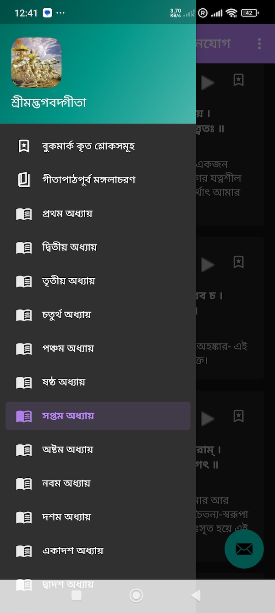

# GeetaInBangla 
This is a simple android application  to easily read geeta in bangla, bookmark mantras and track progress. 

# 📚 GeetaInBangla (শ্রীমদ্ভগবদ্গীতা)

* এই অ্যাপ্লিকেশনটি সহজে শ্রীমদ্ভগবদ্গীতা পড়া ও শেখার জন্য তৈরি করা হয়েছে। যারা গীতার সত্য জানতে এবং তা জীবনে প্রয়োগ করে মানসিক শান্তি অর্জন করতে আগ্রহী তাদের সকলের জন্য এটি উৎসর্গ করা হল। *

---

## ✨ বিবরণ

This app is designed to help users read the Bhagavad Gita in Bangla in easy to understand interface, verse audio recitation support, bookmark and un-bookmark verses and user-friendly navigation.

Key goals:

- Enable easy reading of Gita chapters and verses
- Provide audio playback for verses
- Allow bookmarking for quick reference
- Display meanings in Bangla

---

## ✅ Developed Features

- ✅ Display chapters and verses from JSON assets
- ✅ Audio playback for each verse (Online - available verses only)
- ✅ Bookmarks for favorite verses
- ✅ Clean, easy to understand UI 
- ✅ Works offline for reading
- ✅ Bangla text rendering with proper fonts

---

## 📸 App Screenshots

  
  
  
  
  
  

---

## 🚀 Upcoming Features

- 🔜 Arrange bookmarks in proper order 
- 🔜 Track reading progress and personal dashboard
- 🔜 Share verses via message and social apps
- 🔜 Multiple audio sources integration 

---

## 🐞 Known Issues

- Audio playback might fail if audio file is not availavle (or offline)
- Bookmarks are in jumbled order 

---

## 🙏 Acknowledgements

The meanings of the verses in this application have been sourced from <a href="https://gitasanghabd.org/gita.php">Shree Shree Gita Sangha Bangladesh</a>.

The application streams audio of the verses directly from the <a href="https://www.holy-bhagavad-gita.org/">Holy Bhagavad Gita website</a>.

Heartfelt respect and thanks to the creators of these two websites for making it easier to read and understand the verses of the Gita.

---

## 📄 License

This application is copyright protected. © 2025 **Dip Ranjon Das**.
This project is licensed under [Apache License 2.0](https://www.apache.org/licenses/LICENSE-2.0).

---

